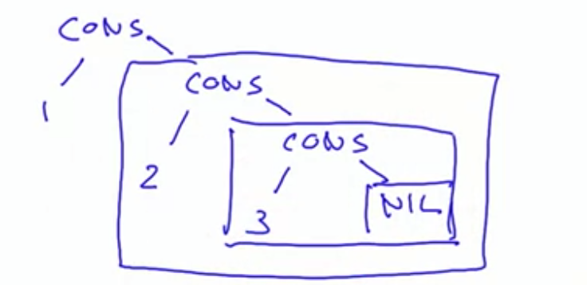

# Data and abstractions

## Class Hierarchies

### Abstract Classes

Consider the task of writing a class for sets of integers with the following operations.

```scala
abstract class IntSet:
	def incl(x: Int): IntSet
	def contains(x: Int): Boolean
```

IntSet is an abstract class. Abstract classes can contain members which are missing an implementation (in our case, both incl and contains); these are called abstract members. Consequently, no direct instances of an abstract class can be created, for instance an IntSet() call would be illegal.

Let's consider implementing sets as binary trees. There are two types of possible trees: a tree for the empty set, and a tree consisting of an integer and two sub-trees. Here are their implementations:

```scala
class Empty() extends IntSet:
	def contains(x: Int): Boolean = false
	def incl(x: Int): IntSet = NonEmpty(x, Empty(), Empty())
```

```scala
class NonEmpty(elem: Int, left: IntSet, right: IntSet) extends IntSet:
	def contains(x: Int): Boolean =
		 if x < elem then left.contains(x)
		 else if x > elem then right.contains(x)
		 else true
	
// This returns a new tree, but some elements are part of both the tree, the new one and the old one, because craetes a new node only of the elements explored during the assignment of x. This is called Persistent Data structure, because the old data structure persist despite the creation of a new tree.
	def incl(x: Int): IntSet = 
		 if x < elem then NonEmpty(elem, left.incl(x), right)
		 else if x > elem then NonEmpty(elem, left, right.incl(x))
		 else this
```

It seems overkill to have the user create many instances of IntSet, we can create an **object definition**:

```scala
object Empty extends IntSet: 
	def contains(x: Int): Boolean = false
	def incl(x: Int): IntSet = NonEmpty(x, Empty, Empty)
```

This defines a **singleton object** named Empty. No other Empty instance can be created. Singleton objects are values, so Empty evaluates to itself.

An object and a class can have the same name. This is possible since Scala has two global namespaces: one for types and one for values. Classes live in the type namespace, whereas objects live in the term namespace. **If a class and object with the same name are given in the same sourcefile, we call them companions**. E.g.

```scala
class IntSet ...
object IntSet:
	def singleton(x: Int) = NonEmpty(x, Empty, Empty)
// This defines a method to build sets with one element, which can be called as IntSet.singleton(elem).
```

**A companion object of a class plays a role similar to static class definitions in Java (which are absent in Scala)**.

## Cons-Lists

A fundamental data structure in many functional languages is the immutable linked list. It is constructed from two building blocks:

- **Nil**: the empty list.

- **Cons**: a cell containing an element and the remainder of the list.

  E.g. List(1, 2, 3)

  

Definition of List:

```scala
trait List[T]:
  def isEmpty: Boolean
  def head: T
  def tail: List[T]

// concept of polymorphism, same method definition but different implementations
class Cons[T](val head: T, val tail: List[T]) extends List[T]:
  def isEmpty = false

class Nill[T] extends List[T]:
  def isEmpty = true
  def head = throw new NoSuchElementException("Nil.head")
  def tail = throw new NoSuchElementException("Nil.tail")

val list = Cons(1, Cons(2, Cons(3,Nill())))
print(list.tail.head) // It prints 2
```

## Pure Object Orientation

A pure object-oriented language is one in which every value is an object. If the language is based on classes, this means that the type of each value is a class. 

Conceptually, types such as Int or Boolean do not receive special treatment in Scala. They are like the other classes, defined in the package scala. For reasons of efficiency, the Scala compiler represents the values of type scala.Int by 32-bit integers, and the values of type scala.Boolean by Java's Booleans, etc.

BUT, conceptually, one could define those types as a class from first principles, for instance, the class Boolean:

```scala
abstract class Boolean extends AnyVal:
	def ifThenElse[T](t: => T, e => T): T

	// true && false = true.&&(false) = true.ifThenElse(false, false) = false
	// true && true = true.&&(true) = true.ifThenElse(true, false) = true
	def && (x: => Boolean): Boolean = ifThenElse(x, false)


// if true object, always pick the then part
// e.g. true.ifThenElse(a, b) = a
object true extends Boolean
	def ifThenElse[T](t: => T, e: => T) = t

// for false object, always pick the else part
// e.g. false.ifThenElse(a, b) = b
object false extends Boolean:
	def ifThenElse[T](t: => T, e: => T) = e
```

**We have seen that Scala's numeric types and Boolean type can be implemented like normal classes.**

**What about functions?**

In fact function values are treated as objects in Scala. The function type A => B is just an abbreviation for the class scala.Function1[A, B], which is defined as follows:

```scala
package scala
trait Function1[A, B]:
	def apply(x: A): B

// e.g. anonymous function (x: Int) => x * x
new Function1[Int, Int]:
	def apply(x: Int) = x * x
```

So functions are objects with apply methods.


