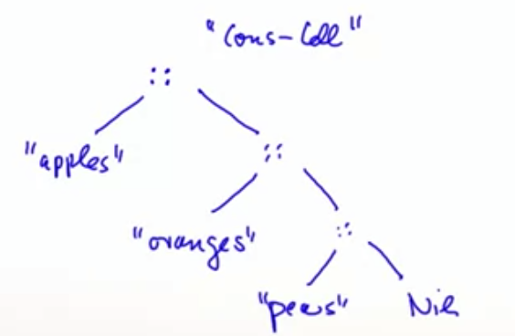
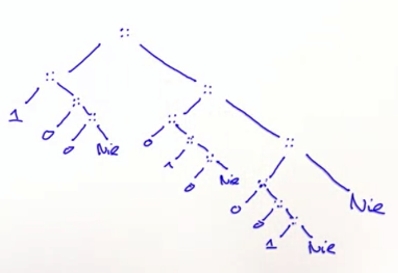

# Types and Pattern Matching

## Pattern Matching

We would like to find a general and convenient way to access heterogenous data in a class hierarchy. Scala supports functional decomposition with case class.

```scala
case class Person(name: String, relation: String)
```

**Case class** generates a lot of code for us, with the following benefits: 

- An apply method is generated, so you don't need to use the new keyword to create a new instance of the class.

  ```scala
  val armando = Person("Armando", "bad")
  ```

- Accessor methods are generated for each constructor parameter, because case class constructor parameters are public val fields by default, but mutator values are not generated.

  ```scala
  armando.name // returns Armando
  armando.name = "Luca" // error: reassignment to val
  ```

- Equals and hashCode methods are generated, which lets you compare objects and easily use them as keys in maps (and sets).

- Copy method built-in, helpful when you need to clone an object and change one or more fields during the cloning process.

  ```scala
  val armandoGood = armando.copy(relation = "good")
  ```

- **An unapply method is generated, and is works well when you need to extract information in match expressions (so pattern matching to access heteregenous data in a class hierarchy)**.

  ```scala
  armando match 
    case Person(n, r) => println(n, r) // will print (Armando, bad) because is a Person's instance.
    case Animal(n, r) => println("hope not")
  ```

  **A MatchError exception is thrown if no pattern matches the value of the selector**.

## Lists

The list is a fundamental data structure in functional programming. A list having x1, ..., xn as elements is written List(x1, ..., xn). There are two important differences between lists and arrays:

- List are immutable - the elements of a list cannot be changed.
- List are recursive, while arrays are flat.

```scala
val fruit = List("apples", "oranges", "pears")
```




```scala
val diag3 = List(List(1, 0, 0), List(0, 1, 0), List(0, 0, 1))
```



Like arrays, **lists are homogenous**: the elements of a list must all have the same type. The type of a list with elements of type T is written scala.List[T].

**All lists are constructed from:**

- **The empty list Nil, and**
- **The construction operation :: (pronunced cons): x :: xs gives a new list with the first element x, followed by the elements of xs.**

E.g. the previous fruit list can be written like:

```scala
val fruit = "apples" :: ("oranges" :: ("pears" :: Nil)) // we can omit parenthesis
```

All the operations on list can be express in terms of the following three:

- **Head**: the first element of the list
- **tail**: the list composed of all the elements except the first
- **isEmpty**: true if the list is empty, false otherwise.

**If the list is empty, 'head' throws a 'NoSuchElementException'**

E.g.

```scala
fruit.head = "apples"

fruit.tail.head == "oranges"
```

We can use pattern matching like with case class for lists. E.g.

```scala
list match { 1 :: 2 :: xs => ... // matches the list that start with 1 and 2
             x :: Nil => ... // list of length 1
           	 List(x) => ... // same as x :: Nil
           	 List() => ... // empty list, same as Nil
           	 List(2 :: xs) => ... // A list that contains as only element another list that starts with 2
           }
```

## Enums

Sometimes we just need to compose and decompose pure data without any associated functions. Case classes aand pattern matching work well for this task.

E.g. we can put all case classes in the Expr companion object in order to not pollute the global namespace:

```scala
trait Expr
object Expr:
	case class Var(s: String) extends Expr
	case class Number(n: Int) extends Expr
	case class Sum(e1: Expr, e2: Expr) extends Expr
	case class Prod(e1: Expr, e2: Expr) extends Expr
```

Pure data definitions like these are called **algebraic data types** (ADTs), they are common in functional programming. To make them even more convenient, Scala offers some special syntax:

```scala
enum Expr:
	case Var(s: String) 
	case Number(n: Int) 
	case Sum(e1: Expr, e2: Expr) 
	case Prod(e1: Expr, e2: Expr) 
```

This is equivalent to the case class hierarchy in the previous snippet, but is shorter, since it avoids the repetitve case class and 'extends Expr' notation. Cases of an enum can also be simple values, without any parameters.

**ADTs and enums are particularly useful for domain modelling tasks where one needs to define a large number of data types without attaching operations.** E.g. modelling payment methods: 

```scala
enum PaymentMethod:
	case CreditCard(kind: Card, holder: String, number: Long, expires: Date)
	case Paypal(email: String)
	case Cash

enum Card:
	case Visa, Mastercard, Amex
```

**Enums are typically used for pure data, where all operations on such data are defined elsewhere.**

## Types Bounds

Suppose assertAllPos takes Empty sets and NonEmptySet (for instance IntSet). A way to express this is:

```scala
def assertAllPos[S <: IntSet](r: S): S = ...
```

Here, "<: IntSet" is an upper bound of the type parameter S. It means that S can be instantiated only to types that conform to IntSet. Generally the notation:

- S <: T means: S is a subtype of T. In our example can be  IntSet or NonEmptySet.
- S >: means: S is a supertype of T, or T is a subtype of S. In our example S could be one of NonEmpty, IntSet, AnyRef, or Any.

**Covariance**: If NonEmpty <: IntSet => List[NonEmpty] <: List[IntSet], because their subtyping relationship varies with the type parameter.

