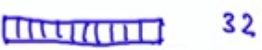
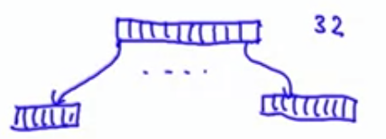
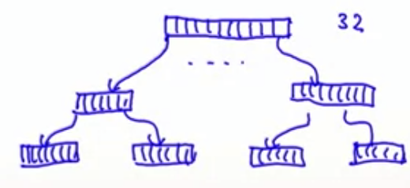
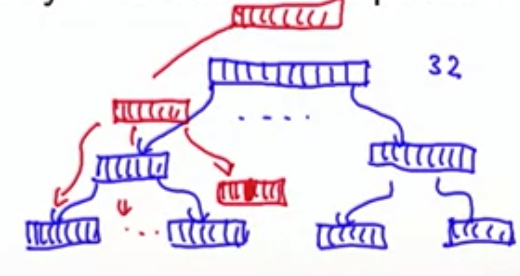
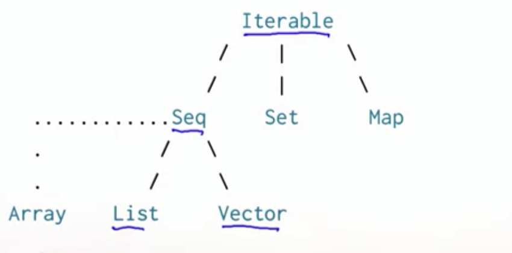

## Other Sequences

We have seen that lists are linear. Access to the first element is much faster than access to the middle or end of a list. The scala library also defines an alternative sequence implementation, **vector. This one has more evenly balanced access patterns than a List.** Because based on the functional paradigm, every time there is a change in a List, you have to create a new one, and to read an element at the end of the list, you have to scroll all the list.

**Idea**:

- The idea is that vector is a tree-based data structure. For instance if the vector is small (up to 32 elements), than is just an array).            

  

- If the vector grows beyond 32 elements, it becomes an array of array which each of them has 32 elements (In total 32 * 32 = 1024).

  

- If it grows again, each of the sub-array, will spawn a 32-cell array. This can grow till a depth of 5 ( 2^25 elements max size).

  

- If you have to edit an element, let's say in the example in the last children based the above image. All the acenstors (parent and parent of the parent) need to change (in red in the image below the changes). This is still better than changing all the list.

  

  

```scala
val num = Vector(1, 2, 3, 4, 5)
```

They support the same operations as list, with the exception of '::', instead of x :: xs, there is:

- x +: xs  = Create a new vector with leading element x, followed by all elements of xs.
- xs :+ x = Create a new vector with trailing element x, preceded by all elements of xs.

### Collection Hierarchy



A common base class of List and Vector is Seq, the class of all sequences. Seq itself is a subclass of Iterable. **Array is defined in java, so can't be a directly subclass of Sequence. What happens instead is that array is a separate class but the conversion is automatically to a subclass of Sequence. So Arrays and Strings support the same operations as Seq and can implicitly be converted to sequence when needed.**

```scala
val xs: Array[Int] = Array(1, 2, 3)
xs.map(x => 2 * x)

val ys: String = "Hello world"
ys.filter(_.isUpper)
```

**Another simple kind of sequence is the range. It represents a sequence of evenly spaced integers. Three operators**:

- Until (exclusive)

```scala
val r: Range = 1 until 5 // 1, 2, 3, 4
```

- To (inclusive)

```scala
val s: Range = 1 to 5 // 1, 2, 3, 4, 5
```

- By (to determine step value)

```scala
1 to 10 by 3 // 1, 4, 7, 10
6 to 1 by -2 // 6, 4, 2
```

**More sequence operations**:

- xs.exists(p) = true if there is an element of x of xs such that p(x) holds, false otherwise.
- xs.forall(p)  = true if p(x) holds for all elements x of xs, false otherwise.
- xs.zip(ys) = A sequence of pairs drawn from corresponding elements of sequences xs and ys

```scala
List(1, 2, 3).zip(Vector("a", "b")) // List((1, "a"), (2, "b"))
```

- xs.unzip = Splits a sequence of pairs xs into two sequences consisting of first, respectively second halves of all pairs.
- xs.flatMap(f) = Applies collection-valued function f to all elements of xs and concatenates the results.
- xs.sum  = The sum of all elements of this numeric collection.
- xs.product = The product of all elements of this numeric collection.
- xs.max = The maximum of all elements of this collection (an Ordering must exist).
- xs.min = The minimum of all elements of this collection.
