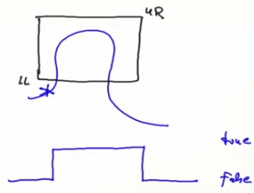

# Functions and State

Every form of mutable state is constructed from variables. A variable definition is written like a value definition, but with the keyword var in place of val. In the case of variable definitions, this association can be changed later through an assignment. State and assignments make our mental model of computation more complicated. In particular, we lose referential transparency. On the other hand, the assignment allows us to formulate certain programs in an elegant way. As always the choice between functional and imperative programming must be made depending on the situation.

# Timely Effects

## Functional Reactive Programming (FRP)

Reactive programming is about reacting to sequences of events that happen in time.

Functional view: Aggregate an event sequence into a signal.

- A signal is a value that changes over time.
- It is represented as a function from time to the value domain.
- Instead of propagating updates to mutable state, we define new signals in terms of existing ones.

E.g.

- Event-based view: Whenever the mouse moves, an event: MouseMoved(toPos: Position) is fired.

- FRP view: A signal mousePosition:Signal[Position] which at any point in time represents the current mouse position.

NOTE: React.js, Elm, are FRP systems.

### Fundamental Signal Operations

There are two fundamental operations over signals:

1. Obtain the value of the signal at the current time. In our library this is expressed by () application (mousePosition() for example).

2. Define a signal in terms of other signals. In our library, this is expresed by the Signal constructor.

   ```scala
   // Creates a signal that, at any point in time is equal to the test wheteher mousePosition at that point in time is in the box [LL..UR].
   def inRectangle(LL: Position, UR: Position): Signal[Boolean] =
   	Signal {
         val pos = mousePosition()
       	// ask if position is between LL and UR when it is is true, otherwise false (digital signal) 
       	LL <= pos && pos <=UR
     }
   
   // val s = InRectangle(L, R)
   // s() 
   // s()
   // ... each time I call s() gives a different value based on the position at time of the signal
   ```

   

## Computing Signals

The idea of FRP is quite general. It does not prescribe whether signals are continous or discrete and how a signal is evaluated. There are several possibilities:

1. A signal could be evaluated on demand, every time its value is needed.
2. A continous signal could be sampled at certain points and interpolated in between.
3. Updates to a discrete signal could be propagated automatically to dependent signals.

We can use a Signal.Var to define a signal. Expressions of type Signal cannot be updated. But our library also defines a subclass Signal.Var of Signal for signals that can be changed. Signal.Var provides an "update" operation, which allows to redefine the value of a signal from the current time on.

```scala
val sig = Signal.Var(3)
sig.update(5) // From now on, sig returns 5 instead of 3.
```

